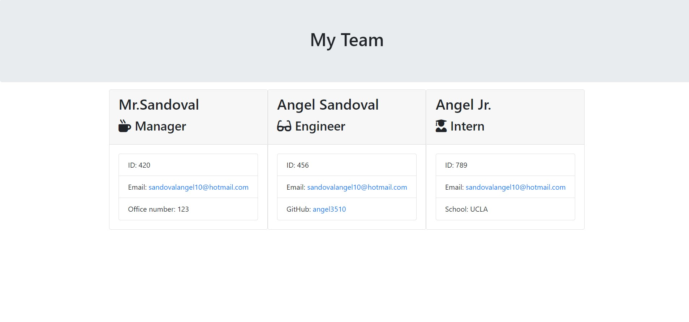

# Team Profile Generator

The Team Profile Generator is a Node.js command-line application that takes in information about employees on a software engineering team and generates an HTML webpage that summaries for each person.

## Starting the application

This application uses Inquirer for collecting input from the user. The application will be invoked by using the following command:

* node index.js

* Running tests

This application uses Jest for running unit tests. The application's tests will be invoked by using the following command:

* npm test

* Jest tests ALL passing

## Screenshot of HTML Sample

## Application structure

Directory Structure:

    .
    ├── __tests__/             //jest tests
    │   ├── Employee.test.js
    │   ├── Engineer.test.js
    │   ├── Intern.test.js
    │   └── Manager.test.js
    ├── dist/                  // rendered output (HTML) and CSS style sheet      
    ├── lib/                   // classes
    ├── src/                   // template helper code 
    ├── .gitignore             // indicates which folders and files Git should ignore
    ├── index.js               // runs the application
    └── package.json   

## Application classes

This application includes Employee, Manager, Engineer, and Intern classes. The tests for these classes (in the _tests_ directory) ALL pass.

The first class is an Employee parent class with the following properties and methods:

    name

    id

    email

    getName()

    getId()

    getEmail()

    getRole()—returns 'Employee'

The other two classes extend Employee.

In addition to Employee's properties and methods, Manager also have the following:

    officeNumber

    getRole()—overridden to return 'Manager'

In addition to Employee's properties and methods, Engineer also have the following:

    github—GitHub username

    getGithub()

    getRole()—overridden to return 'Engineer'

In addition to Employee's properties and methods, Intern also have the following:

    school

    getSchool()

    getRole()—overridden to return 'Intern'